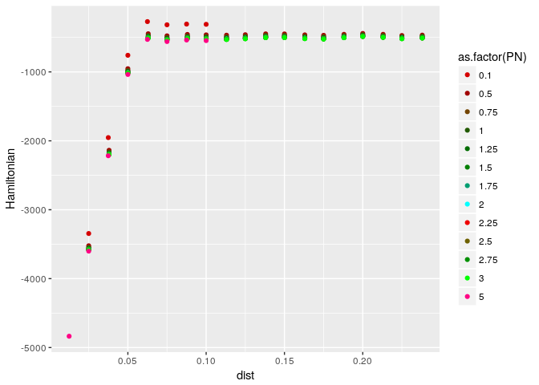
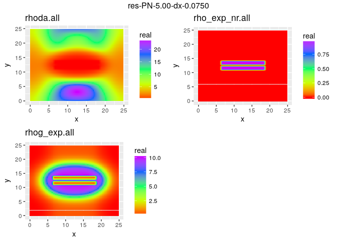
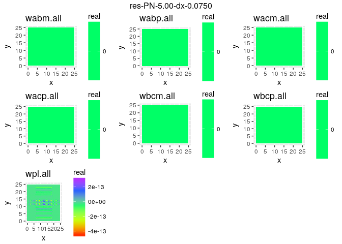
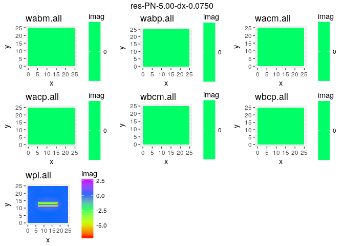

Calculation of PMF and Densities
================

This reads and stores the actual hamiltonians

    ## Warning: NAs introduced by coercion

    ## Warning: NAs introduced by coercion

Plotting Hamil(P/N,dist)
------------------------

``` r
refine <- refine %>% dplyr::filter(PN <=5 )
print(ggplot2::ggplot(refine,aes(x=dist, y=Hamiltonian,color=as.factor(PN))) + geom_point()+scale_color_hue(l = 30, c = 360))
```



Plotting Densities
------------------

``` r
experiments <- list.dirs(path = ".", full.names = FALSE, recursive = FALSE)
experiments<-experiments[grep("PN",experiments)]
experiments<-sort(experiments)
experiments<-experiments[-grep("sigma", experiments)]


for (i in experiments[grep("res",experiments)])
{
  print_denstities(i)
  hi1<-print_fields(i,2)
  hi2<-print_fields(i,3)
}
```



Plotting Fields
---------------

``` r
print_field(file.path("PN-5.00-dx-0.0125","wpl.all"),"imag")
```


